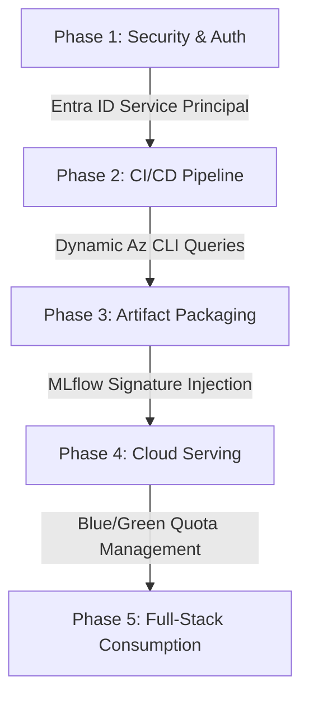

# 🚀 Enterprise MLOps Playbook: End-to-End Azure ML & GitHub Actions CI/CD

When designing production Machine Learning pipelines on Azure using GitHub Actions, adhering to systematic engineering standards separates fragile prototypes from resilient enterprise systems. 

This master playbook covers the **5 Core Lifecycle Phases**, architectural best practices, and the exact real-world blocker gotchas encountered (and solved) during real-world deployments.

---

## 📐 The 5-Phase MLOps Architecture



---

## 🟢 Phase 1: Security & Authentication Foundation

### 1. Zero-Credential Leakage
* **Rule**: Never store personal Azure login passwords or hardcode subscription IDs in codebase files.
* **Implementation**: Create a Dedicated Microsoft Entra ID **Service Principal** (or OpenID Connect OIDC Federated Credential) with `Contributor` role access to your target Resource Group.
* **Storage**: Store credentials exclusively in GitHub **Repository Secrets** (`AZURE_CREDENTIALS`).
* **Environment Isolation**: Utilize GitHub Action Environments (`dev`, `staging`, `prod`) with separate approval rules and scoped secrets.

---

## 🟡 Phase 2: CI/CD Pipeline Engineering (GitHub Actions)

### 1. Dynamic Cloud Infrastructure Detection
* **Best Practice**: Never hardcode Azure Resource Group (`rg-...`) or Workspace (`mlw-...`) names in YAML files. In automated cloud environments, resource IDs rotate dynamically.
* **Solution**: Query Azure Resource Graph dynamically inside CI steps:
  ```bash
  RG_NAME=$(az group list --query "[?starts_with(name,'rg-ai300')].name | [0]" -o tsv)
  WS_NAME=$(az ml workspace list -g "$RG_NAME" --query "[0].name" -o tsv)
  az configure --defaults group="$RG_NAME" workspace="$WS_NAME"
  ```

### 2. Workflow Token Permissions
* **Gotcha Encountered**: `HttpError 403: Resource not accessible by integration`.
* **Root Cause**: GitHub Actions default runner tokens operate in **Read-Only** mode. When automated scripts attempt to post evaluation summaries back to Pull Request threads, GitHub rejects the REST call.
* **The Fix**: Explicitly declare write permissions at the root of every `.github/workflows/*.yml` file:
  ```yaml
  permissions:
    contents: read
    issues: write
    pull-requests: write
  ```

---

## 🟠 Phase 3: Model Training & Artifact Packaging (MLflow)

### 1. Environment Parity (The #1 MLOps Killer)
* **Gotcha Encountered**: Azure Inference Container crashing on startup with HTTP `502 Bad Gateway` and Kubernetes Probe failures:
  > `Readiness probe failed: HTTP probe failed with statuscode: 502`
  > `ModuleNotFoundError: No module named 'azureml-ai-monitoring'`
* **Root Cause**: Mismatched Python execution environments. When an MLflow model is serialized on Python 3.14 locally but executed inside Azure's curated `mlflow-py310-inference` Docker container, dependency discrepancies cause the Gunicorn web server to crash. Furthermore, Azure's real-time scoring engine strictly requires internal telemetry wrappers (`azureml-ai-monitoring`).
* **The Master Fix**: 
  1. Always regenerate model artifacts inside CI/CD runners using standardized Python versions matching the cloud target.
  2. Explicitly inject Azure monitoring dependencies into the MLflow model saving signature:
  ```python
  mlflow.sklearn.save_model(
      model, 
      "model_dir",
      pip_requirements=[
          "scikit-learn==1.4.2",
          "pandas",
          "mlflow",
          "azureml-ai-monitoring" # Critical for Azure ML inference containers
      ]
  )
  ```

---

## 🔴 Phase 4: Managed Online Endpoints (Real-Time Serving)

### 1. Dedicated Cloud Quota Management
* **Gotcha Encountered**: `Out of Quota / QuotasExceeded` errors during blue/green deployment creation.
* **Root Cause**: Azure Managed Online Endpoints provision dedicated virtual machines (e.g., `Standard_D2as_v4` = 2 to 4 vCPUs per instance). Standard cloud labs enforce a strict **8 vCPU region ceiling**. Abandoning old test endpoints rapidly exhausts quota.
* **The Fix**:
  * Program dynamic, collision-free endpoint identifiers in CI/CD: `endpoint-name: "app-${{ github.run_id }}"`.
  * Establish automated script teardowns (`az ml endpoint delete`) or enforce strict zero-downtime traffic migrations (`traffic={"blue": 100}`) before provisioning new compute SKUs.

### 2. Blue/Green Deployment Socket Resets
* **Gotcha Encountered**: `urllib.error.URLError: [WinError 10054] Connection forcibly closed by remote host`.
* **Root Cause**: When CI/CD triggers an update to an active deployment (`az ml online-deployment update`), Azure terminates existing container pods before new ingress routes pass readiness checks.
* **The Fix**: Never send client traffic until Azure Studio confirms **Provisioning State = Succeeded**. Implement exponential retry backoff logic in consumer software.

---

## 🔵 Phase 5: Client Consumption & Full-Stack Integration

### 1. Browser CORS & Gateway Security
* **Gotcha Encountered**: Direct client-side Javascript `fetch("https://.../score")` blocked by browser Cross-Origin Resource Sharing (CORS) security policy.
* **Root Cause**: Public cloud inference endpoints reject arbitrary web browser origins to prevent cross-site request forgery and unauthorized billing consumption.
* **The Fix**: Never call Azure ML REST endpoints directly from frontend HTML/JS. Implement a lightweight **Backend Proxy Server** (`server.py` via Python/Node/Go) that handles key authorization and attaches explicit headers:
  ```python
  headers = {
      "Content-Type": "application/json",
      "Accept": "application/json",
      "Authorization": f"Bearer {AZURE_ML_PRIMARY_KEY}",
      "User-Agent": "Mozilla/5.0 EnterpriseClient/1.0" # Prevents firewall bot blocks
  }
  ```

### 2. Strict MLflow Payload Serialization
* **Rule**: Azure ML MLflow scoring containers enforce strict Scikit-Learn tensor structures.
* **Implementation**: Format POST JSON payloads precisely matching training column hierarchy:
  ```json
  {
    "input_data": {
      "columns": ["Feature1", "Feature2", "Feature3"],
      "index": [0],
      "data": [[Val1, Val2, Val3]]
    }
  }
  ```

---

## 📋 Summary Checklist for Your Next Project

1. [ ] **Setup**: Create Entra ID Service Principal & configure GitHub Repository Secrets.
2. [ ] **CI Pipeline**: Add dynamic `az group list` queries & `pull-requests: write` permissions.
3. [ ] **Packaging**: Export MLflow models with explicit `azureml-ai-monitoring` requirements.
4. [ ] **Serving**: Provision Managed Online Endpoints with careful vCPU SKU quota tracking.
5. [ ] **Consumption**: Build a secure backend proxy server to handle API keys and CORS.
